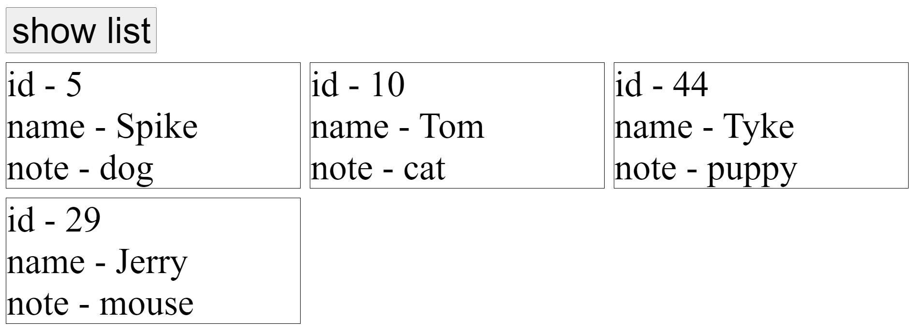
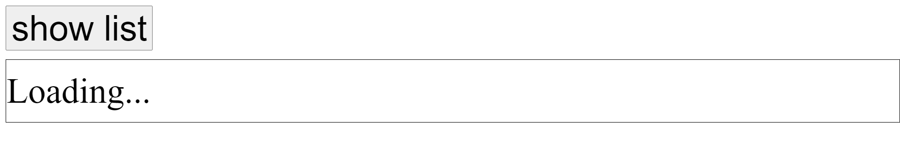

# Lifecycle

## Task1

Create a component in ./app/Task1/index.js.  
It should send a request to the backend using `Fetch API` and then render the received data (Look at ./server/index.js for the list to use in the task).

The component should show "Loading..." while waiting for the response.

1. Install dependencies
   `yarn install`

2. Run webpack
   `yarn watch`

3. Run server
   `yarn server`
